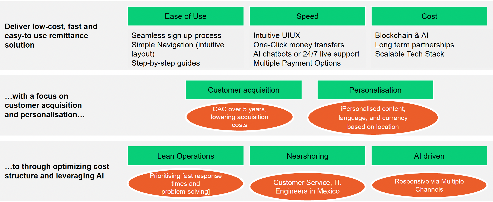

# Corzo

An instant-feeling payment app powered by blockchain, **without making users deal with blockchain**.

Send money by username or email, not wallet addresses. No gas. No token jargon. 
Under the hood, Corzo settles transfers on-chain via a gasless relayer flow and returns a real confirmation + tx hash, while the UI stays as simple as a normal fintech app.


## How Corzo works

1) **Sign up + verify**
- A user creates an account and verifies their email.

2) **Wallet created automatically (behind the scenes)**
- Corzo generates an EOA wallet for the user.
- The wallet address is stored in MongoDB.
- The private key is stored **encrypted** (never shown to the user).

3) **Deposit**
- When the user deposits, funds are converted into **USDT0** and held in the user’s wallet.
- To the user, it simply feels like “I deposited money into my Corzo account.”

4) **Send**
- The user enters a **username/email**.
- Corzo resolves the recipient from our database.
- Corzo submits a **gasless USDT0 transfer** via the Plasma relayer.
- The UI polls status and displays confirmation + tx hash.

5) **Withdraw**
- Corzo converts the user’s USDT0 into their chosen currency and sends it to their payout method.

## Demo Video Link
https://drive.google.com/file/d/1BQRGtxFnrVuGFp7PrnZiOsIKQF2qjm38/view?usp=sharing

## Quick Start
1) Backend (Flask)  
```bash
cd mobile-app/Backend
python3 -m venv .venv && source .venv/bin/activate   # win: .venv\Scripts\activate
pip install -r requirements.txt
export PLASMA_RELAYER_API_KEY=your-key
flask --app app.py run --host 0.0.0.0 --port 5050
# backend: http://127.0.0.1:5050
```

2) Frontend (static HTML/JS)  
```bash
cd mobile-app/frontend
python3 -m http.server 8000   # or any static server, e.g. npx serve .
# open http://localhost:8000/index.html
```

3) Wallet / Plasma Testnet  
- In the browser, click “Connect Wallet” then “Switch Plasma” to add chainId 0x2612.  
- Balance reads & send page use `https://testnet-rpc.plasma.to`.

4) Optional test script  
```bash
cd mobile-app/Backend
python3 test_full_verification.py   # hits http://127.0.0.1:5050/api
```

“What if sending money abroad could be as fast as sending a text? With Corzo, international transfers take as little as two seconds—securely and with lower exchange rates based on the mid-market rate.”

## Overview
Your international money transfer alternative. Corzo lets you send money quickly, safely, and affordably—lower exchange rates based on the mid-market rate, and transfers in as little as two seconds.

Our platform moves money instantly - from the USA to Mexico at the lowest cost.
No waiting days
No 5-9% fees


## Architecture

```mermaid
%%{init: {'flowchart': {'curve': 'basis', 'nodeSpacing': 90, 'rankSpacing': 90}}}%%
flowchart LR
  subgraph FE["Frontend<br/>mobile-app/frontend"]
    direction TB
    FE_PAGES["HTML/CSS/JS Pages<br/>index • send • login • register • verify-email"]
    FE_CORE["script.js + modules.js<br/>auth helpers • UI • dashboard refresh"]
    FE_WEB3["plasma.js (ethers.js)<br/>MetaMask • chain switch • balance read<br/>gasless transfer UI"]
    FE_PAGES -->|"loads"| FE_CORE
    FE_PAGES -->|"loads"| FE_WEB3
  end

  subgraph BE["Backend<br/>Flask (app.py)"]
    direction TB
    BE_API["REST API<br/>/api/register • /api/login • /api/verify-email<br/>/api/users/exists • /api/wallet • /api/dashboard<br/>/api/usdt/transfer • /api/usdt/status"]
    BE_AUTH["Auth & Security<br/>JWT • email verification"]
    BE_WALLET["Wallet & Transfers<br/>wallet creation • gasless signing"]
    BE_API -->|"uses"| BE_AUTH
    BE_API -->|"uses"| BE_WALLET
  end

  subgraph EXT["External Services"]
    direction TB
    DB["MongoDB Atlas<br/>users • wallets • transactions"]
    RELAYER["Plasma Relayer API<br/>dev.api.relayer.plasma.to"]
    RPC["Plasma Testnet RPC<br/>testnet-rpc.plasma.to"]
    EMAIL["EmailService (SMTP)<br/>activation • reset"]
  end

  FE_CORE -->|"fetch /api/*"| BE_API
  FE_WEB3 -->|"fetch /api/*"| BE_API
  FE_WEB3 -->|"read balance"| RPC

  BE_API -->|"pymongo"| DB
  BE_API -->|"send mail"| EMAIL
  BE_API -->|"submit (X-Api-Key)"| RELAYER
  BE_API -->|"status/receipts"| RPC
  RELAYER -->|"broadcast"| RPC

  classDef node fill:#FFFFFF,stroke:#5B6BAA,stroke-width:1px,color:#1F2330,rx:10,ry:10;
  classDef ext fill:#FFFFFF,stroke:#6B5BAA,stroke-width:1px,color:#1F2330,rx:10,ry:10;

  class FE_PAGES,FE_CORE,FE_WEB3,BE_API,BE_AUTH,BE_WALLET node;
  class DB,RELAYER,RPC,EMAIL ext;

  style FE fill:#F3F6FF,stroke:#C7D2FE,stroke-width:1px,rx:16,ry:16;
  style BE fill:#F5F3FF,stroke:#D8B4FE,stroke-width:1px,rx:16,ry:16;
  style EXT fill:#F7F7FB,stroke:#D1D5DB,stroke-width:1px,rx:16,ry:16;

  linkStyle default stroke:#6B7280,stroke-width:1.2px;
  ```


“What if sending money abroad could be **as fast as sending a text?** With Corzo, international transfers take as little as two seconds—securely and with lower exchange rates based on the mid-market rate.”




## Cash Out Network
### Strategic Partnership Infrastructure
**Partner 1:**
- The largest pharmacy network in Latin America, providing cash-out infrastructure across the region.
- More than **9,500** Locations across Mexico, Chile, and Colombia.
A- ccessible locations in urban and rural areas

__Why this partnership works__
- Trusted brand with 25+ years in operation.
- High foot traffic and accessibility.
- Proven cash handling infrastructure.
- Extended operating hours (many 24/7).


**Partner 2:** 
- Operates a few thousand stores across Latin America and a few hundred in the U.S. 25,987 OXXO stores in its Proximity Americas division (Mexico, Brazil, Chile, Colombia, Peru, and the U.S.).
- Of these, **23,206** are in Mexico as of end 2024, implying roughly **2,800–2,900** stores across the rest of the Americas.

__Why this partnership works__
- Massive daily-use footprint.
- Stores are embedded in everyday routines—high-frequency, convenience-driven traffic that is hard to replicate through digital or traditional retail alone.
- Proven operating model beyond Mexico, with thousands of stores already operating successfully across multiple Latin American markets and the U.S., OXXO has shown it can localize, scale, and execute consistently.
- Physical reach and last-mile relevance.
- The network enables fast, low friction access to consumers where they already are especially valuable for payments, pickups, services, and omnichannel strategies.
- Trusted brand at neighborhood level.
- Isn’t just big; it’s familiar. That trust lowers adoption barriers for new services introduced through the partnership.
- Room to grow internationally: While Mexico remains the core, the **~3,000** stores outside Mexico represent a meaningful and expanding platform for regional growth without starting from zero.

## Problem Statement
**Social and Economic Implications**
- 4% of GDP is remittance, on essential areas such as food, health care, education, housing.

**Slow Processing Time**
- 5 days for bank transfers, while faster transfers incur high fees.

**Unfavourable Fees**
- 9% fees, leaving much lesser for remittance recipients.


## Scale - Why this matters economically?
- Mexico receives **$66B** in remittances every year.
- **$53B** flows through the U.S. to Mexico corridor.
- That makes Mexico the **2nd** most remittance recipient globally and **1st** in Latin America.
- Even a 1% improvement in how this money moves represents a **$1.76B** opportunity while directly improving lives.

## Closing: Confidence in the Solution
**Project Goal:**
Become the most high-tech and lowest-cost operator in the cash transfer business.
 
## Milestones Achieved / In Progress
__Workstream 1__ 
**MVP Development:**
- Designed and built a minimum viable product focused on low transaction fees.
- Ensures rapid fund access for users.
__Workstream 2__
**Partnerships:**
- Collaborating with partners, local banks, microfinance institutions, and retailers.
- Preparing fundraising and financing to scale operations.
__Workstream 3__
**strategic Alliances:**
- Engaging mobile network operators for broad reach.
- Aligning with regulatory bodies to ensure full compliance.
 
### What’s Next
- **Pilot program:** Launch MVP in target corridor (U.S. to Mexico).
- **Expand partnerships:** Onboard more financial and retail partners.
- **Scale reach:** Use mobile networks to reduce costs and time further.
- **Measure impact:** Track user savings, faster transfers, and fee reduction.
 
### How to Get Involved
- **Investors:** Join our journey to capture a $1.76B opportunity while transforming lives.
- **Partners:** Collaborate to expand financial inclusion and low-cost remittances.
- **Advocates & users:** Be part of a platform that delivers money instantly, securely, and affordably.


## Team
Mirley Perez Sanchez
Arryl Tham Pac Haye
Tolgahan Güney


